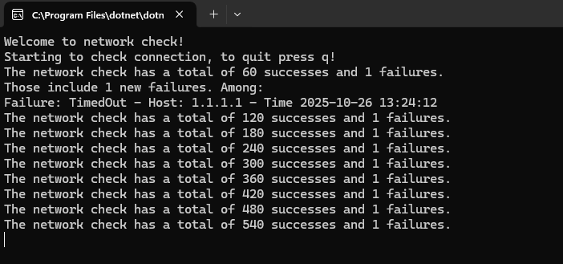

# Readme - NetDisGuard
## About
Network Disruption Guard is a lightweight console tool to monitor the stability of your network connection. You can keep it running in the background and it will show you information about potential connection issues.

<b>Current Version:</b> 0.0.1

## Showcase

## Options (program arguments)
<table>
    <tr>
        <th>Arguments*</th>
        <th>Description</th>
    </tr>
    <tr>
        <td>"SleepMilliseconds", "sleep", "s"</td>
        <td>Determines the time between pings in ms</td>
    </tr>
    <tr>
        <td>"PingTimeoutMilliseconds", "pingTimeout", "timeout", "p", "t"</td>
        <td>Determines the time for a timeout for individual pings in ms</td>
    </tr>
    <tr>
        <td>"InfoEveryPings", "info", "i"</td>
        <td>Determines after how many ping checks an info message should be printed to the console</td>
    </tr>
</table>
<i>* All Arguments are case insentive and need to be started with a minus. 
E.g.: ".\NetDisGuard.exe -i 5" for an info message every 5 pings.</i>